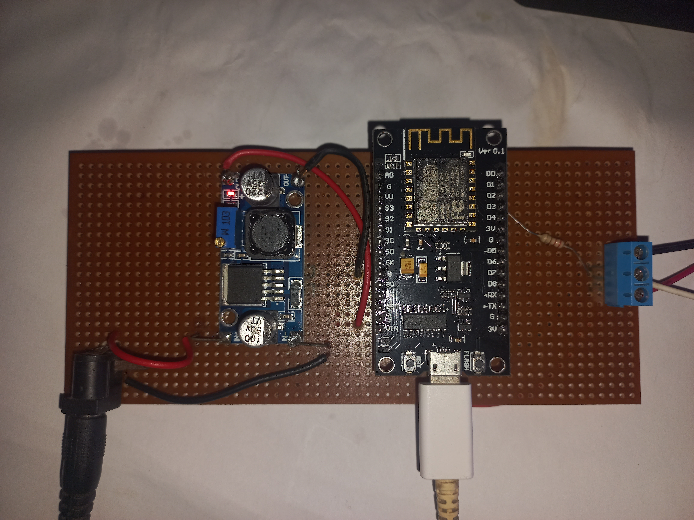
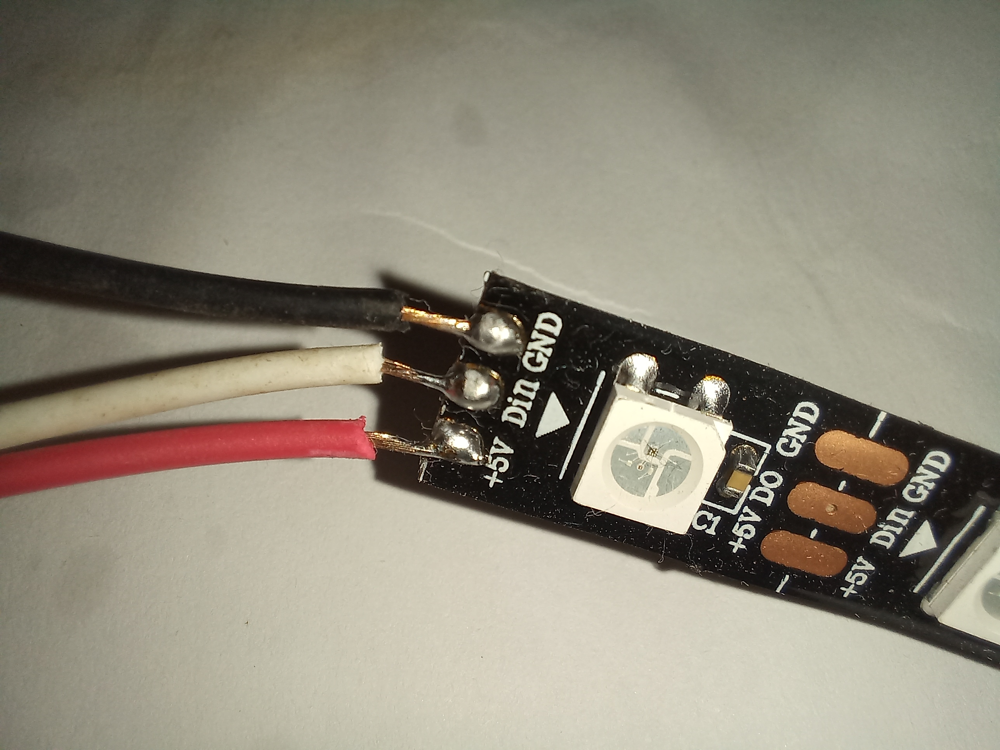
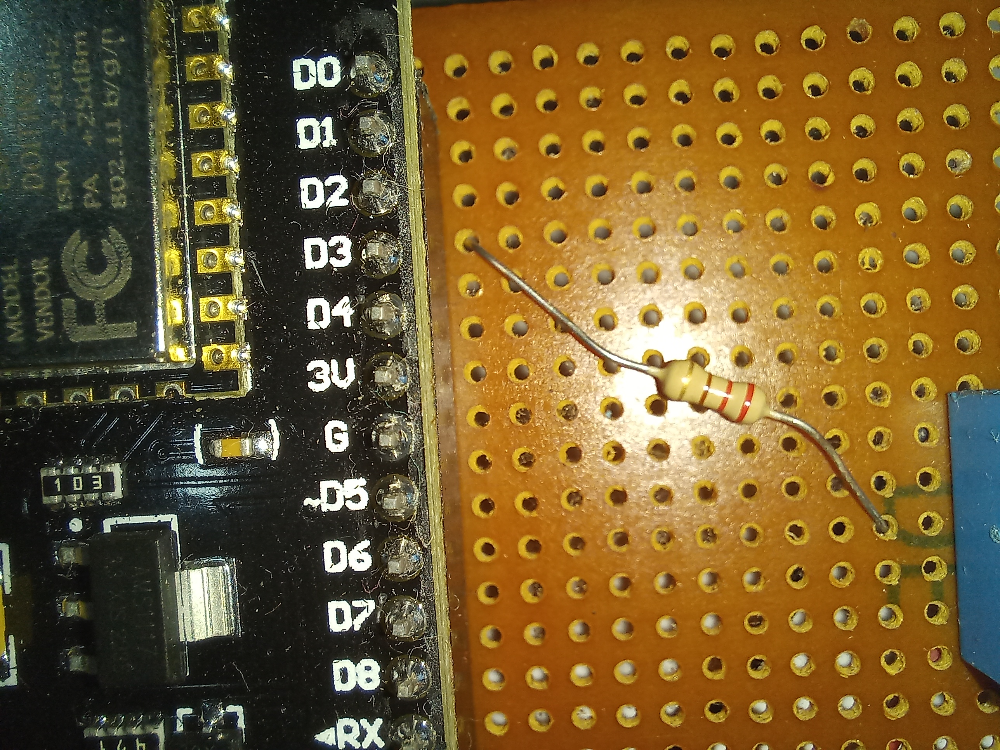

# Screen Color Sync
"Screen Color Sync" is an innovative software application that enables you to synchronize the colors of your NeoPixel LED strip with the colors of your computer screen in real-time. It achieves this by capturing the colors of your computer screen and sending them in hexadecimal format to a connected NodeMCU microcontroller, which then processes the data and outputs the corresponding color values to the NeoPixel LED strip.

With "Screen Color Sync", you can customize the number of LED pixels on the strip, the frequency of color updates, and even the range of colors displayed on the LED strip. Whether you're looking to create a unique ambiance in your living room, office, or workspace, this app provides a fun and exciting way to showcase your creativity and technical skills.

In addition to its intuitive user interface and easy-to-use features, "Screen Color Sync" is also compatible with a wide range of operating systems and hardware configurations, making it accessible to users with varying levels of technical expertise.

Overall, "Screen Color Sync" is a versatile and powerful tool that allows you to bring your creative ideas to life and transform your space into a colorful and vibrant environment.

## Features

* Captures screen colors in real-time.
* Sends color data to an Arduino board connected to NeoPixel LED strip.
* Visualizes the screen colors in real-time on the LED strip.
* Simple and user-friendly interface.

## Requirements

* Java Runtime Environment (JRE) version 8 or above.
* Arduino board compatible with Adafruit NeoPixel library.
* NeoPixel LED strip.
* USB cable to connect the Arduino board to the computer.

## How to Use

1. Download and install the Java Runtime Environment (JRE) version 8 or above.
2. Download and install the Arduino IDE.
3. Connect the NeoPixel LED strip to the Arduino board.
4. Upload the Arduino code to the board using the Arduino IDE.
5. Open the ScreenGrab application.
6. Click on the start button to capture the screen colors and visualize them on the LED strip.
7. Click on the stop button to stop capturing the screen colors.

## Limitations

* The application captures the screen colors only from the primary screen.
* The LED strip connected to the Arduino board should be compatible with the Adafruit NeoPixel library.

## Images of hardware

